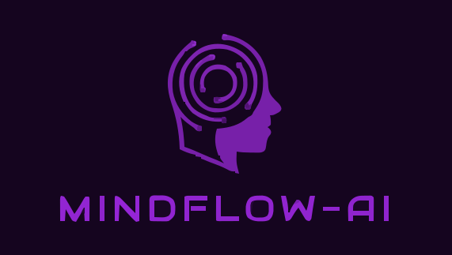

# 🧠 The MindMates - Complete Mental Health Platform

<div align="center">
  
  
  **A comprehensive mental health platform empowering young minds through AI-powered therapy, peer support, gamification, and professional care.**
  
  [](https://reactjs.org/)
  [](https://firebase.google.com/)
  [](https://nodejs.org/)
  [](https://socket.io/)
  [](https://peerjs.com/)
  [](LICENSE)
</div>

---

## 🌟 Platform Overview

**The MindMates** is a revolutionary mental health platform designed specifically for students, teenagers, and young professionals in India. We combine cutting-edge technology with empathetic care to make mental health support accessible, stigma-free, and engaging.

### 🎯 Our Mission
To democratize mental health care through a blend of technology, empathy, and community. Breaking barriers and making asking for help as normal as asking for water.

---

## ✨ Core Features

### 🤖 AI-Powered Therapy
- **Meet Ira**: Our empathetic AI therapist trained for mental health support
- **Natural Language Processing**: Conversations in multiple languages
- **Personalized Responses**: Tailored advice based on user patterns
- **24/7 Availability**: Always there when you need support
- **Emotion Recognition**: AI detects emotional states and responds appropriately

### 💬 Real-Time Peer Support
- **Instant Messaging**: Secure peer-to-peer communication
- **Video Calling**: High-quality WebRTC video calls with screen sharing
- **Voice Messages**: Easy voice note recording and sharing
- **File Sharing**: Share documents, images, and resources
- **Anonymous Mode**: Connect without revealing identity
- **Typing Indicators**: Real-time conversation feedback

### 🎮 Gamified Mental Health Journey
- **Achievement System**: Unlock badges for consistency and progress
- **XP & Levels**: Experience points for mental health activities
- **Daily Quests**: Simple, achievable mental health tasks
- **Mood Garden**: Virtual ecosystem reflecting your emotional state
- **Mindfulness Challenges**: Guided meditation and breathing exercises
- **Progress Tracking**: Visual analytics of your mental health journey

### 📅 Professional Care Integration
- **Doctor Appointments**: Book sessions with licensed mental health professionals
- **Google Meet Integration**: Seamless video consultations
- **Appointment Management**: Schedule, reschedule, and track sessions
- **Email Notifications**: Automated appointment reminders
- **Session History**: Track your professional care journey

### 📊 Comprehensive Analytics
- **Mood Tracking**: Daily emotional state logging
- **Journal Analytics**: Sentiment analysis of your writings
- **Progress Charts**: Visual representation of mental health trends
- **Wellness Radar**: Multi-dimensional wellness assessment
- **Streak Tracking**: Monitor consistency across activities

### 🏥 Educational Institution Support
- **School Integration**: Dedicated portals for educational institutions
- **Bulk User Management**: Easy student onboarding
- **Campus Events**: Mental health awareness programs
- **Crisis Support**: Emergency intervention protocols
- **Academic Stress Management**: Specialized support for students

---

## 🏗️ Technical Architecture

### Frontend Stack
- **React 19.0.0**: Modern functional components with hooks
- **Vite**: Lightning-fast build tool and development server
- **Tailwind CSS 4.1.3**: Utility-first CSS framework
- **Framer Motion**: Smooth animations and transitions
- **React Router**: Client-side routing and navigation
- **Recharts**: Beautiful data visualization charts

### Backend Infrastructure
- **Express.js**: RESTful API server
- **Socket.IO**: Real-time bidirectional communication
- **PeerJS Server**: WebRTC signaling for video calls
- **Firebase**: Authentication, database, and cloud storage
- **Node.js**: Runtime environment

### Real-Time Communication
- **WebRTC**: Peer-to-peer video calling
- **Socket.IO**: Instant messaging and notifications
- **PeerJS**: Simplified WebRTC implementation
- **WebSocket**: Low-latency real-time updates

### Data & Storage
- **Firestore**: NoSQL document database
- **Firebase Auth**: Secure user authentication
- **Local Storage**: Client-side data persistence
- **Firebase Storage**: File uploads and media storage

---

## 🚀 Quick Start Guide

### Prerequisites
- **Node.js 18+** - [Download here](https://nodejs.org/)
- **Modern Browser** - Chrome, Firefox, Safari, or Edge
- **Git** - For version control
- **Firebase Account** - For backend services

### 1. Clone Repository
```bash
git clone https://github.com/Rohansingh3001/Mindmate.git
cd Mindmate
```

### 2. Backend Setup
```bash
# Navigate to backend directory
cd Backend

# Install dependencies
npm install

# Start the server (runs on port 3000)
npm start
```

**Backend Services:**
- REST API: `http://localhost:3000`
- Socket.IO: `http://localhost:3000`
- PeerJS Server: `http://localhost:9000/peerjs`

### 3. Frontend Setup
```bash
# Navigate to frontend directory
cd Mental-health

# Install dependencies
npm install

# Start development server
npm run dev
```

**Frontend Access:**
- Application: `http://localhost:5173`
- Hot reload enabled for development

### 4. Firebase Configuration
1. Create a Firebase project at [console.firebase.google.com](https://console.firebase.google.com)
2. Enable Authentication, Firestore, and Storage
3. Update `Mental-health/public/firebase-config.js` with your config
4. Set up Firebase security rules

### 5. Environment Variables
Create `.env` file in `Mental-health/` directory:
```env
# Core Configuration
VITE_SOCKET_URL=http://localhost:3000
VITE_WS_URL=ws://localhost:3000
VITE_PEER_HOST=localhost
VITE_PEER_PORT=9000
VITE_PEER_SECURE=false
VITE_API_BASE_URL=http://localhost:3000

# Email Service (EmailJS)
VITE_EMAILJS_SERVICE_ID=your_service_id
VITE_EMAILJS_TEMPLATE_ID=your_template_id
VITE_EMAILJS_PUBLIC_KEY=your_public_key

# Production (Update for deployment)
# VITE_SOCKET_URL=https://your-domain.com
# VITE_PEER_HOST=your-domain.com
# VITE_PEER_PORT=443
# VITE_PEER_SECURE=true
```

---

## 📱 Application Structure

```
The MindMates/
├── Backend/                      # Express.js server
│   ├── app.js                   # Main application file
│   ├── server.js                # Server configuration
│   ├── controllers/             # Business logic
│   ├── routes/                  # API endpoints
│   ├── utils/                   # Utility functions
│   └── websocket/               # Socket.IO handlers
│
├── Mental-health/               # React frontend
│   ├── public/                  # Static assets
│   │   ├── logo.svg
│   │   ├── firebase-config.js
│   │   └── communication-skills.svg
│   │
│   ├── src/
│   │   ├── components/          # Reusable UI components
│   │   │   ├── ChatBot.jsx      # AI therapist interface
│   │   │   ├── ConnectPeer.jsx  # Video calling component
│   │   │   ├── MoodTracker.jsx  # Emotion logging
│   │   │   ├── GamifiedDashboard.jsx
│   │   │   └── ...
│   │   │
│   │   ├── pages/               # Main application pages
│   │   │   ├── Home.jsx         # Landing page
│   │   │   ├── User.jsx         # User dashboard
│   │   │   ├── ChatPage.jsx     # Chat interface
│   │   │   ├── AdminPanel.jsx   # Admin dashboard
│   │   │   └── PeerDashboard.jsx
│   │   │
│   │   ├── admin/               # Admin management
│   │   │   ├── Dashboard.jsx    # Analytics overview
│   │   │   ├── Users.jsx        # User management
│   │   │   ├── Appointments.jsx # Session management
│   │   │   ├── Schools.jsx      # Institution management
│   │   │   └── ...
│   │   │
│   │   ├── context/             # React context providers
│   │   ├── utils/               # Helper functions
│   │   └── Routes/              # Application routing
│   │
│   ├── package.json             # Dependencies and scripts
│   ├── vite.config.js          # Vite configuration
│   └── tailwind.config.js      # Tailwind CSS config
│
└── README.md                    # This file
```

---

## 🎮 Gamification Features

### Achievement System
- **Journal Streaks**: Consistency badges for daily writing
- **Mood Tracking**: Emotional intelligence milestones
- **Mindfulness**: Meditation and breathing achievements
- **Social Connection**: Peer support interaction rewards
- **Professional Care**: Therapy session completion badges

### XP and Levels
```javascript
const XP_ACTIVITIES = {
  DAILY_JOURNAL: 15,
  MOOD_LOG: 10,
  PEER_CHAT: 20,
  VIDEO_CALL: 30,
  MINDFULNESS: 25,
  ASSESSMENT_COMPLETE: 50,
  APPOINTMENT_ATTEND: 100
};
```

### Virtual Rewards
- **Mood Garden**: Plant virtual flora based on emotions
- **Scratch Cards**: Surprise rewards for milestones
- **Customization**: Unlock themes, avatars, and features
- **Certificates**: Achievement certificates for major milestones

---

## 👥 User Roles & Permissions

### 🧑‍🎓 Students/General Users
- Access to AI therapist and peer support
- Gamified mental health tracking
- Professional appointment booking
- Community features and forums
- Personal analytics and insights

### 🧑‍⚕️ Mental Health Professionals
- Patient dashboard and session management
- Appointment scheduling and video calls
- Progress tracking and notes
- Crisis intervention tools
- Professional resources library

### 🏫 Educational Institutions
- Bulk student management
- Campus-wide mental health programs
- Crisis detection and intervention
- Analytics and reporting
- Custom branding and integration

### 👑 Platform Administrators
- Comprehensive user management
- System analytics and monitoring
- Content moderation and safety
- Feature configuration
- Technical system oversight

---

## 🔒 Security & Privacy

### Data Protection
- **End-to-end encryption** for sensitive communications
- **HIPAA-compliant** data handling practices
- **Firebase security rules** for database protection
- **Input validation** and sanitization
- **Rate limiting** on all API endpoints

### Privacy Features
- **Anonymous mode** for peer support
- **Data deletion** options for users
- **Consent management** for data collection
- **Minimal data collection** principle
- **Transparent privacy policy**

### Authentication
- **Multi-factor authentication** support
- **Social login** integration (Google, Facebook)
- **Role-based access control**
- **Session management** and timeout
- **Password security** requirements

---

## 📊 Analytics & Insights

### User Analytics
- **Mood trends** and pattern recognition
- **Activity tracking** and engagement metrics
- **Progress visualization** and goal tracking
- **Wellness scores** and recommendations
- **Crisis detection** algorithms

### Administrative Analytics
- **Platform usage** statistics
- **User engagement** metrics
- **Crisis intervention** tracking
- **Feature adoption** analysis
- **Performance monitoring**

### Institutional Reports
- **Student wellness** overview
- **Engagement patterns** analysis
- **Crisis events** documentation
- **Program effectiveness** metrics
- **Custom reporting** tools

---

## 🌐 API Documentation

### Authentication Endpoints
```javascript
POST /api/auth/login          // User login
POST /api/auth/register       // User registration
POST /api/auth/google         // Google OAuth
GET  /api/auth/me            // Get current user
POST /api/auth/logout        // User logout
```

### Socket.IO Events
```javascript
// Client Events
emit('join-user', { userId, userType })
emit('join-chat', { chatId, userId })
emit('send-message', { chatId, message, sender })
emit('typing', { chatId, userId, isTyping })
emit('initiate-call', { targetUserId, callType })

// Server Events
on('receive-message', (message) => {})
on('typing', ({ userId, isTyping }) => {})
on('incoming-call', (callData) => {})
on('call-accepted', (connectionData) => {})
on('user-online', (userId) => {})
```

### REST API Endpoints
```javascript
// Appointments
GET    /api/appointments         // List appointments
POST   /api/appointments         // Create appointment
PUT    /api/appointments/:id     // Update appointment
DELETE /api/appointments/:id     // Cancel appointment

// Users
GET    /api/users               // List users (admin)
GET    /api/users/:id           // Get user details
PUT    /api/users/:id           // Update user
DELETE /api/users/:id           // Delete user

// Analytics
GET    /api/analytics/mood      // Mood analytics
GET    /api/analytics/usage     // Platform usage
GET    /api/analytics/wellness  // Wellness metrics
```

---

## 🧪 Testing

### Running Tests
```bash
# Frontend tests
cd Mental-health
npm run test

# Backend tests
cd Backend
npm run test

# End-to-end tests
npm run test:e2e
```

### Test Coverage
- **Unit Tests**: Component and function testing
- **Integration Tests**: API and database interactions
- **E2E Tests**: User journey testing
- **Performance Tests**: Load and stress testing
- **Security Tests**: Vulnerability scanning

---

## 🚀 Deployment

### Frontend Deployment (Vercel/Netlify)
```bash
# Build production bundle
npm run build

# Deploy to Vercel
vercel --prod

# Deploy to Netlify
netlify deploy --prod --dir=dist
```

### Backend Deployment (Railway/Heroku)
```bash
# Set environment variables
export NODE_ENV=production
export PORT=3000

# Deploy to Railway
railway deploy

# Deploy to Heroku
git push heroku main
```

### Firebase Setup
1. **Authentication**: Enable Google and Email providers
2. **Firestore**: Set up collections and security rules
3. **Storage**: Configure file upload rules
4. **Hosting**: Deploy static assets (optional)

### Environment Configuration
```javascript
// Production environment variables
VITE_SOCKET_URL=https://api.mindmates.com
VITE_PEER_HOST=peer.mindmates.com
VITE_PEER_SECURE=true
VITE_API_BASE_URL=https://api.mindmates.com
```

---

## 📈 Future Roadmap

### Phase 1: Core Enhancement (Q2 2025)
- [ ] Advanced AI therapy capabilities
- [ ] Enhanced video quality and features
- [ ] Mobile app development (React Native)
- [ ] Advanced analytics dashboard
- [ ] Multi-language support expansion

### Phase 2: Professional Integration (Q3 2025)
- [ ] Electronic Health Records (EHR) integration
- [ ] Prescription management system
- [ ] Insurance billing integration
- [ ] Telehealth compliance (HIPAA)
- [ ] Professional certification programs

### Phase 3: Community & Social (Q4 2025)
- [ ] Public forums and communities
- [ ] Mentorship program platform
- [ ] Peer review and rating system
- [ ] Content creation tools
- [ ] Social media integration

### Phase 4: Advanced Features (2026)
- [ ] Machine learning mood prediction
- [ ] Wearable device integration
- [ ] Virtual reality therapy sessions
- [ ] Blockchain-based privacy
- [ ] Global expansion and localization

---

## 🤝 Contributing

We welcome contributions from developers, mental health professionals, and advocates! Here's how you can help:

### Development Contributions
```bash
# Fork the repository
git fork https://github.com/Rohansingh3001/Mindmate

# Create feature branch
git checkout -b feature/amazing-feature

# Make your changes
git add .
git commit -m "Add amazing feature"

# Push to branch
git push origin feature/amazing-feature

# Create Pull Request
```

### Contribution Guidelines
1. **Code Quality**: Follow ESLint rules and best practices
2. **Documentation**: Update docs for new features
3. **Testing**: Add tests for new functionality
4. **Accessibility**: Ensure WCAG compliance
5. **Privacy**: Maintain user data protection standards

### Areas for Contribution
- **Frontend Development**: React components and UI/UX
- **Backend Development**: API endpoints and database
- **Mental Health Content**: Therapy exercises and resources
- **Accessibility**: Screen reader and keyboard navigation
- **Security**: Vulnerability testing and fixes
- **Documentation**: User guides and technical docs

---

## 📋 License

This project is licensed under the **MIT License** - see the [LICENSE](LICENSE) file for details.

```
MIT License

Copyright (c) 2025 The MindMates

Permission is hereby granted, free of charge, to any person obtaining a copy
of this software and associated documentation files (the "Software"), to deal
in the Software without restriction, including without limitation the rights
to use, copy, modify, merge, publish, distribute, sublicense, and/or sell
copies of the Software, and to permit persons to whom the Software is
furnished to do so, subject to the following conditions:

The above copyright notice and this permission notice shall be included in all
copies or substantial portions of the Software.
```

---

## 🙏 Acknowledgments

### Technology Partners
- **React Team** - For the incredible framework
- **Firebase** - For reliable backend infrastructure
- **Socket.IO** - For real-time communication
- **PeerJS** - For simplified WebRTC implementation
- **Tailwind CSS** - For beautiful, responsive design

### Mental Health Advisors
- Licensed therapists and counselors who provided guidance
- Mental health organizations supporting our mission
- Beta testers and early adopters
- Educational institutions partnering with us

### Open Source Community
- Contributors who made this platform possible
- Library maintainers whose tools we use
- Security researchers who help keep users safe
- Accessibility advocates ensuring inclusive design

---

## 📞 Support & Contact

### Technical Support
- **GitHub Issues**: [Report bugs and feature requests](https://github.com/Rohansingh3001/Mindmate/issues)
- **Email**: dev@mindmates.com
- **Discord**: [Join our developer community](https://discord.gg/mindmates)

### Mental Health Crisis Resources
- **National Suicide Prevention Lifeline**: 988
- **Crisis Text Line**: Text HOME to 741741
- **International Association for Suicide Prevention**: [iasp.info](https://iasp.info)

### Business Inquiries
- **Partnership**: partnership@mindmates.com
- **Institutional**: schools@mindmates.com
- **Press**: press@mindmates.com

---

<div align="center">

**🌟 Made with ❤️ for mental health and human connection 🌟**

*"Making mental health support as accessible as a text message and as personal as a conversation with a friend."*

---

### ⭐ Star this repository if you believe in making mental health accessible to everyone!

[⬆️ Back to Top](#-the-mindmates---complete-mental-health-platform)

</div>
