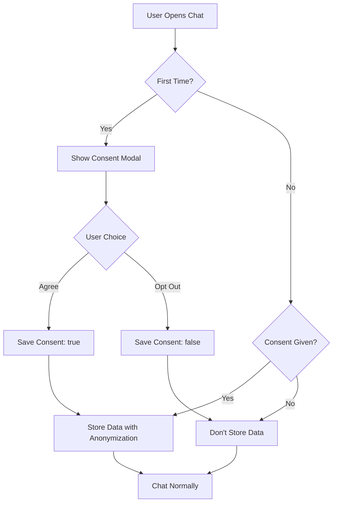

# 🧠 MindMates AI Training Data Pipeline

## DPDP Act 2023 Compliant Training Data Collection System

This system implements a complete feedback flywheel for collecting, anonymizing, and structuring real user conversations to improve the MindMates AI companions.

---

## 🔄 The Feedback Flywheel

```
Real Users 🧍 
    ↓
Chats with Ira 💬
    ↓
Explicit Consent ✅
    ↓
Data Anonymization 🧹
    ↓
Structured Storage 📦
    ↓
Fine-Tuning Dataset 🤖
    ↓
Smarter Ira 🌱
    ↓
Better User Experience 🎯
    ↓
(Cycle Repeats)
```

---

## 🛡️ Privacy & Compliance

### DPDP Act 2023 Compliance

✅ **Explicit Consent Required**
- Users see consent modal before first chat
- Clear "Agree" / "Opt Out" options
- Transparent explanation of data usage
- Can change preference anytime in Settings

✅ **Data Minimization**
- Only stores prompt-response pairs
- No user identifiers stored with data
- Consent tracked per-user, not with data

✅ **Purpose Limitation**
- Data used ONLY for AI model training
- Never sold or shared with third parties
- Clear disclosure in consent modal

---

## 🔐 Anonymization Process

### What We Remove (PII Filtering)

Our system automatically removes:

- ❌ **Names**: "Hi, I'm Rohan" → "Hi, I'm <USER>"
- ❌ **Emails**: "contact@example.com" → "<EMAIL>"
- ❌ **Phone Numbers**: "9876543210" → "<PHONE>"
- ❌ **Cities**: "I'm from Delhi" → "I'm from <CITY>"
- ❌ **Addresses**: "House No 123, MG Road" → "<ADDRESS>"
- ❌ **Ages**: "I'm 25 years old" → "I'm <AGE> years old"
- ❌ **Dates**: "My birthday is 15/08/1998" → "My birthday is <DATE>"
- ❌ **URLs**: "Visit www.example.com" → "Visit <URL>"

### What We Keep

- ✅ **Conversation Patterns**: Flow and structure
- ✅ **Emotional Context**: Sentiment and mental health signals
- ✅ **Language Patterns**: Hindi/English mix, regional phrases
- ✅ **Topic Categories**: Anxiety, stress, depression, etc.

### Example Transformation

**Original Message:**
```
"Hi, I'm Rohan from Delhi. I'm 25 years old and feeling anxious about my 
exam tomorrow. Can you help? My email is rohan@example.com"
```

**Anonymized Version:**
```
"Hi, I'm <USER> from <CITY>. I'm <AGE> years old and feeling anxious about my 
exam tomorrow. Can you help? My email is <EMAIL>"
```

**Stored Training Data:**
```json
{
  "prompt": "Hi, I'm <USER> from <CITY>. I'm <AGE> years old and feeling anxious about my exam tomorrow. Can you help?",
  "response": "Hi! I'm here to help you. Exam anxiety is completely normal. Let's work through this together...",
  "language": "en",
  "persona": "ira",
  "category": "anxiety",
  "timestamp": "2025-10-28T10:30:00.000Z"
}
```

---

## 📊 Data Structure for Training

### Training Data Format (JSONL)

Each conversation is stored as one line in JSONL format:

```jsonl
{"prompt":"Mujhe exam stress ho raha hai","response":"Yeh bilkul normal hai, chalo saath me ek chhoti breathing exercise karte hain.","language":"hi","persona":"ira","category":"academic_work"}
{"prompt":"I feel lonely today","response":"I'm here for you. Loneliness can be difficult. Would you like to talk about what's making you feel this way?","language":"en","persona":"ira","category":"relationships"}
{"prompt":"<USER> से breakup ho gaya, bahut dukh ho raha hai","response":"I understand how painful this must be. Breakups are really hard. Let's talk about your feelings...","language":"hi","persona":"ira","category":"relationships"}
```

### Auto-Detected Categories

The system automatically categorizes conversations:

- 🧠 **Anxiety**: Nervousness, worry, panic, ghabrahat
- 😔 **Depression**: Sadness, hopelessness, udaas
- 💪 **Stress**: Pressure, overwhelm, tanav
- 😴 **Sleep Issues**: Insomnia, fatigue, neend
- ❤️ **Relationships**: Family, friends, rishte
- 📚 **Academic/Work**: Exams, career, padhai

---

## 🏗️ System Architecture

### Frontend (React)

**Files:**
- `/src/utils/dataAnonymization.js` - PII removal utilities
- `/src/utils/trainingDataStorage.js` - Storage management
- `/src/components/ChatBot.jsx` - Consent modal & integration

**Storage:**
- **IndexedDB**: Local backup of anonymized data
- **Backend API**: Primary storage with JSONL files

### Backend (Node.js + Express)

**Files:**
- `/Backend/routes/trainingDataRoutes.js` - API endpoints
- `/Backend/training_data/` - JSONL storage directory

**API Endpoints:**
- `POST /api/training-data` - Store anonymized conversation
- `GET /api/training-data/stats` - Get dataset statistics
- `GET /api/training-data/export` - Download full dataset
- `DELETE /api/training-data/clear` - Clear all data (admin)

---

## 🚀 Usage

### For Users

1. Open chat with Ira
2. See consent modal on first use
3. Choose "Agree" or "Opt Out"
4. Chat normally - system handles everything

### For Developers

#### Testing Anonymization

```javascript
import { testAnonymization } from './src/utils/dataAnonymization';

testAnonymization();
```

#### Exporting Training Dataset

```javascript
import { downloadTrainingDataset } from './src/utils/trainingDataStorage';

// Export as JSONL (recommended for fine-tuning)
await downloadTrainingDataset('jsonl');

// Export as JSON
await downloadTrainingDataset('json');
```

#### Getting Statistics

```javascript
import { getTrainingDataStats } from './src/utils/trainingDataStorage';

const stats = await getTrainingDataStats();
console.log(stats);
// Output:
// {
//   total: 10234,
//   byLanguage: { en: 6000, hi: 3234, ta: 1000 },
//   byCategory: { anxiety: 3000, stress: 2500, ... },
//   byPersona: { ira: 10234 }
// }
```

---

## 🎯 Fine-Tuning Your Model

### Step 1: Collect Data

Wait until you have **10,000+** anonymized conversations across different:
- Languages (English, Hindi, Tamil, etc.)
- Categories (anxiety, depression, stress, etc.)
- User scenarios (exams, relationships, work, etc.)

### Step 2: Export Dataset

```bash
# From frontend console or admin panel
await downloadTrainingDataset('jsonl');
```

### Step 3: Prepare for Fine-Tuning

Your JSONL file is ready for:
- **LLaMA 3** fine-tuning
- **Mistral** fine-tuning
- **Gemma** fine-tuning
- **GPT** fine-tuning

Example with Hugging Face:

```python
from datasets import load_dataset

dataset = load_dataset('json', data_files='mindmates_training_data.jsonl')

# Format for instruction tuning
def format_prompt(example):
    return {
        'text': f"### User:\n{example['prompt']}\n\n### Ira:\n{example['response']}"
    }

formatted_dataset = dataset.map(format_prompt)
```

### Step 4: Fine-Tune

```python
from transformers import AutoModelForCausalLM, AutoTokenizer, Trainer

model = AutoModelForCausalLM.from_pretrained("meta-llama/Llama-3-8b")
tokenizer = AutoTokenizer.from_pretrained("meta-llama/Llama-3-8b")

# Train with your MindMates dataset
trainer = Trainer(
    model=model,
    train_dataset=formatted_dataset,
    # ... training config
)

trainer.train()
```

---

## 📈 Monitoring

### Backend API Stats

```bash
curl http://localhost:3000/api/training-data/stats
```

**Response:**
```json
{
  "success": true,
  "stats": {
    "total": 10234,
    "files": 30,
    "byLanguage": {
      "en": 6000,
      "hi": 3234,
      "ta": 1000
    },
    "byCategory": {
      "anxiety": 3000,
      "stress": 2500,
      "depression": 2000,
      "sleep_issues": 1500,
      "relationships": 734,
      "academic_work": 500
    },
    "byPersona": {
      "ira": 10234
    }
  }
}
```

---

## 🔒 Security Best Practices

1. **Never log raw user data** - Always anonymize first
2. **Validate anonymization** - Check for PII before storage
3. **Encrypt at rest** - Use encrypted storage for training data
4. **Access control** - Restrict export/clear endpoints to admins
5. **Regular audits** - Review stored data for PII leaks
6. **User rights** - Allow users to request data deletion

---

## 🧪 Testing

### Test Anonymization

```javascript
import { anonymizeText, validateAnonymization } from './src/utils/dataAnonymization';

const text = "Hi I'm Rohan from Delhi, email: rohan@example.com";
const cleaned = anonymizeText(text);
console.log(cleaned); 
// "Hi I'm <USER> from <CITY>, email: <EMAIL>"

console.log(validateAnonymization(cleaned)); 
// true (no PII detected)
```

### Test Storage

```javascript
import { storeTrainingData } from './src/utils/trainingDataStorage';

await storeTrainingData(
  "I'm feeling anxious about my exam",
  "That's completely normal. Let's work through this together...",
  "user123",
  "en",
  "ira"
);
```

---

## 📋 User Consent Flow



---

## 🌟 Benefits

### For Users
- ✅ Full transparency about data usage
- ✅ Complete control over consent
- ✅ Better AI responses over time
- ✅ Privacy protected by design

### For MindMates
- ✅ Real-world training data (better than synthetic)
- ✅ Multi-language coverage
- ✅ Domain-specific mental health context
- ✅ Authentic Indian conversation patterns
- ✅ DPDP Act 2023 compliant
- ✅ Continuous improvement loop

---

## 📞 Support

For questions or issues:
- GitHub Issues: [Rohansingh3001/Mindmate](https://github.com/Rohansingh3001/Mindmate)
- Email: support@mindmates.in
- Documentation: `/docs/training-data-pipeline.md`

---

**Built with ❤️ for Mental Health by the MindMates Team**
